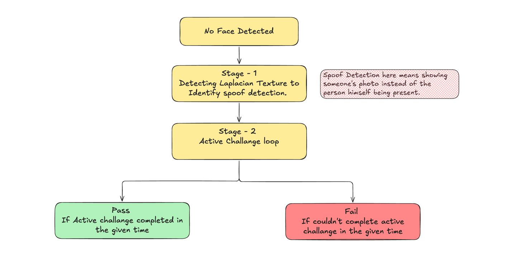

# Liveness Detector

A real-time webcam liveness detection system that verifies a face belongs to a live person — not a photo, screen, or mask — using passive texture analysis followed by active challenges.

## How It Works

The verification pipeline runs in two sequential stages:



### Stage 1 — Passive Texture Check
Over 20 consecutive frames, the Laplacian variance of the face region is measured. A real face has high-frequency texture (pores, wrinkles, hair). A flat photo or screen has noticeably lower variance. A warning is shown if the texture is suspiciously low, but it does not block the challenge.

### Stage 2 — Active Challenges
Two challenges are picked at random from:

| Challenge     | How to complete                          |
|---------------|------------------------------------------|
| Blink         | Blink once (EAR crosses threshold)       |
| Turn Left     | Rotate head left ≥ 15° for 5 frames     |
| Turn Right    | Rotate head right ≥ 15° for 5 frames    |
| Thumbs Up     | Show a thumbs-up gesture for 5 frames   |
| Show Pinky    | Raise only your little finger, 5 frames |

Each challenge has a **6-second timeout**. Failing any one challenge ends the session as FAILED.

### Under the Hood
- **Face landmarks**: MediaPipe FaceLandmarker (478 points) — used for EAR blink detection, head yaw from 3D transformation matrix, and bounding box for texture ROI.
- **Hand landmarks**: MediaPipe HandLandmarker (21 points) — used for finger-extension gesture recognition.
- Models are downloaded automatically (~30 MB face, ~25 MB hand) on first run.

---

## Demo

<table>
  <tr>
    <td align="center"><br/><b>Happy Flow</b></td>
    <td align="center"><br/><b>dev Mode</b></td>
  </tr>
</table>

---

## Requirements

- Python 3.10 or newer
- A working webcam
- ~500 MB disk space (Python packages + ML models)

---

## Setup

### 1. Clone the repository

```bash
git clone https://github.com/Sushant-ctrl/LivelinessDetectorMVP
cd LivelinessDetector
```

### 2. Create a virtual environment

**macOS / Linux**
```bash
python3 -m venv venv
source venv/bin/activate
```

**Windows (PowerShell)**
```powershell
python -m venv venv
venv\Scripts\Activate.ps1
```

### 3. Install dependencies

```bash
pip install -r requirements.txt
```

> The MediaPipe model files (~55 MB total) are downloaded automatically the first time you run the program.

---

## Running the App

### Auto-select camera (recommended)
```bash
python main.py
```

### List all detected cameras
```bash
python main.py --list
```

### Use a specific camera index
```bash
python main.py --camera 1
```

### Developer mode — landmark debug window
Opens a second window showing all MediaPipe face and hand landmarks in real time, alongside live metric readouts (EAR, yaw, texture score).
```bash
python main.py --dev
```

In dev mode, you can also force a specific challenge with number keys:

| Key | Challenge  |
|-----|------------|
| `1` | Blink      |
| `2` | Turn Left  |
| `3` | Turn Right |
| `4` | Thumbs Up  |
| `5` | Pinky      |
| `0` | Random     |

---

## Controls

| Key | Action                          |
|-----|---------------------------------|
| `Q` | Quit                            |
| `R` | Restart with new random challenges |

---

## Install as a Command-Line Tool (optional)

```bash
pip install -e .
liveness-detector
liveness-detector --camera 1
liveness-detector --dev
```

---

## Project Structure

```
LivelinessDetector/
├── main.py            # Entry point — camera loop, state machine
├── face_analyzer.py   # MediaPipe face landmark wrapper (EAR, yaw, texture)
├── hand_analyzer.py   # MediaPipe hand landmark wrapper (gestures)
├── challenges.py      # Challenge types, timing, and completion logic
├── display.py         # OpenCV drawing — UI panels, overlays, progress bars
├── debug_view.py      # Dev-mode landmark visualizer
└── requirements.txt   # Python dependencies
```

---

## Troubleshooting

**Camera not opening**
- Run `python main.py --list` to see detected cameras and their indices.
- Try `--camera 0` or `--camera 1` to select a specific one.

**Models not downloading**
- Ensure you have internet access on first run.
- The models are saved to the project directory; subsequent runs use the local copies.

**mediapipe install fails on Apple Silicon**
```bash
pip install --upgrade pip
pip install mediapipe
```

**Low texture warning keeps appearing**
- Ensure good lighting — shadows and blur lower the texture score.
- Move closer to the camera if the face bounding box is small.
